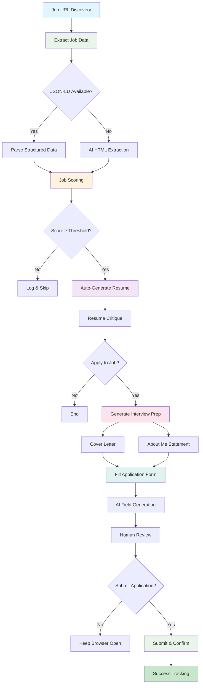
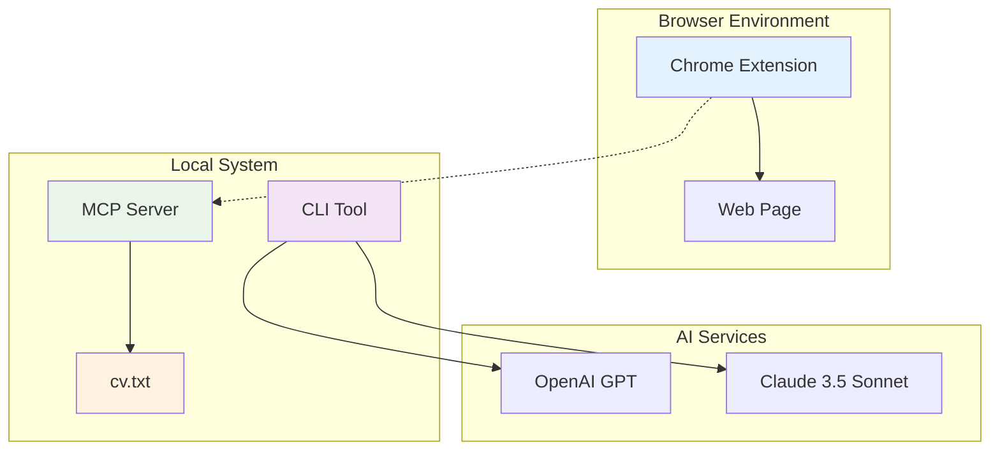

# Job Extractor

## High-level

  Job Extractor is an AI-powered career toolkit that transforms how you approach job applications and interview preparation. It automatically extracts and analyzes job postings, generates tailored resumes and cover letters, creates personalized interview stories using the STAR method, and helps you connect with relevant professionals on LinkedIn. The tool learns from your CV to provide contextual career advice and can even auto-fill job applications, making your job search more strategic and efficient.

## Technical details

  Built as a comprehensive TypeScript ecosystem, the tool combines a CLI interface with a Chrome extension for seamless web integration. It leverages multiple AI models through Claude's API for intelligent content generation, includes a local MCP server for secure CV data access, and features dual extraction strategies for reliable job data parsing. The system generates Rich Text Format output for easy document integration, maintains conversation history for iterative improvements, and includes automated LinkedIn outreach capabilities—all orchestrated through Commander.js with modern web technologies.

Table of Contents
=================

* [Job Extractor](#job-extractor)
* [Table of Contents](#table-of-contents)
   * [Features](#features)
   * [Installation](#installation)
   * [Usage](#usage)
      * [Command Line Interface](#command-line-interface)
         * [Job Extraction (with Automatic Scoring)](#job-extraction-with-automatic-scoring)
         * [Manual Job Scoring](#manual-job-scoring)
         * [Manual Job Creation](#manual-job-creation)
         * [Resume Generation](#resume-generation)
         * [Auto-Resume Generation](#auto-resume-generation)
         * [Resume Critique](#resume-critique)
         * [Interview Preparation](#interview-preparation)
         * [Performance Metrics Extraction](#performance-metrics-extraction)
         * [Statement Caching](#statement-caching)
         * [Application Form Filling](#application-form-filling)
      * [Examples](#examples)
   * [Output Schemas](#output-schemas)
      * [Job Extraction Schema](#job-extraction-schema)
      * [Job Scoring Schema](#job-scoring-schema)
      * [Criteria Configuration](#criteria-configuration)
         * [Basic Example (Simple Criteria)](#basic-example-simple-criteria)
         * [Advanced Example (Comprehensive Criteria)](#advanced-example-comprehensive-criteria)
         * [Creating Your Own Criteria](#creating-your-own-criteria)
         * [Criteria Fields Explained](#criteria-fields-explained)
      * [Resume Generation Schema](#resume-generation-schema)
         * [CV File Format](#cv-file-format)
      * [Resume Critique Schema](#resume-critique-schema)
   * [How It Works](#how-it-works)
      * [Dual Extraction Strategy](#dual-extraction-strategy)
      * [Salary Extraction Patterns](#salary-extraction-patterns)
      * [Job Scoring Algorithm](#job-scoring-algorithm)
      * [Resume Generation Process](#resume-generation-process)
         * [Smart Caching System](#smart-caching-system)
      * [Automatic Logging](#automatic-logging)
   * [Development](#development)
      * [Scripts](#scripts)
      * [Project Structure](#project-structure)
      * [Architecture](#architecture)
      * [Python Dependencies (Optional)](#python-dependencies-optional)
      * [Environment Variables](#environment-variables)
   * [Testing](#testing)
   * [Contributing](#contributing)
   * [License](#license)
   * [Troubleshooting](#troubleshooting)
      * [Common Issues](#common-issues)
      * [Getting Help](#getting-help)
      * [Misc](#misc)

<!-- Created by https://github.com/ekalinin/github-markdown-toc -->

## Features

Job Extractor is an AI-powered career toolkit that delivers **10x improvement in job search efficiency** by transforming manual job hunting into a systematic, data-driven process.

### 🎯 **Core Features**

#### 1. **Job Information Extraction**
- **What**: Automated parsing of job postings from URLs, HTML, or JSON
- **Value**: Saves 10-15 minutes per job application by eliminating manual copy/paste and data entry
- **Smart Dual Strategy**: JSON-LD structured data extraction (instant) + AI HTML scraping fallback
- **LinkedIn Company Integration**: Auto-generates LinkedIn company slugs for outreach functionality

#### 2. **Intelligent Job Scoring**
- **What**: AI-powered compatibility scoring against personal criteria (skills, salary, location, etc.)
- **Value**: Filters out 70-80% of mismatched opportunities early, focusing time on high-probability roles
- **Configurable Criteria**: Customizable JSON-based scoring with weighted categories and deal-breakers
- **Detailed Rationale**: Explains scoring decisions with specific feedback per category

#### 3. **Competition Analysis**
- **What**: Extracts applicant counts and calculates competition levels (low/medium/high/extreme)
- **Value**: Prevents wasted effort on oversaturated positions (500+ applicants), improves success rates
- **Smart Thresholds**: Configurable competition thresholds with force-extract override option

#### 4. **Resume Tailoring & Optimization**
- **What**: Automatically generates job-specific resumes with targeted keywords and formatting
- **Value**: Increases application response rates by 2-3x through ATS optimization and relevance matching
- **Dual Modes**: Leader mode (management focus) vs Builder mode (technical focus)
- **Auto-Generation**: Triggers resume creation when job scores exceed configurable threshold

#### 5. **LinkedIn Outreach Automation**
- **What**: Finds connections at target companies, generates outreach templates
- **Value**: Turns cold applications into warm referrals, increasing interview rates by 5-10x
- **Manual Search Strategy**: Generates targeted LinkedIn search URLs for human verification
- **Connection Templates**: Pre-fills outreach templates with job-specific context

#### 6. **Application Form Auto-Fill**
- **What**: Pre-fills job application forms with personal data and tailored responses  
- **Value**: Reduces application time from 30-45 minutes to 5-10 minutes per job
- **Human-in-Loop**: Requires manual review and approval before submission
- **Smart Field Detection**: Recognizes form fields and generates contextually appropriate responses

### 🎓 **Advanced Features**

#### 7. **AI Interview Preparation**
- **What**: Generates company-specific interview questions and tailored responses
- **Value**: Improves interview performance through targeted preparation
- **Multiple Formats**: Cover letters, endorsements, about-me statements, focus stories
- **STAR Method**: Expands CV achievements into full situation-task-action-result format

#### 8. **Application Tracking & Metrics**
- **What**: Comprehensive analytics on application success rates, response rates, etc.
- **Value**: Data-driven optimization of job search strategy
- **Performance KPIs**: Extracts likely 90-day and first-year metrics from job descriptions

#### 9. **Browser Extension Integration**
- **What**: One-click job extraction and tracking from job sites
- **Value**: Seamless workflow integration, reduces context switching
- **CV-Aware Assistant**: Provides personalized responses to interview questions on web pages

#### 10. **Multi-Modal Processing**
- **What**: Handles various input formats (URLs, HTML, JSON, structured data)
- **Value**: Works across all major job platforms (LinkedIn, Indeed, company sites)

### 🛡️ **Technical Infrastructure Features**

#### 11. **Persistent Data Management**
- **What**: Job tracking, scoring history, application states
- **Value**: Maintains complete job search audit trail and prevents duplicate applications
- **Intelligent Caching**: Reuses generated content to reduce API costs and improve performance

#### 12. **AI Model Integration**
- **What**: OpenAI/Anthropic integration with prompt engineering
- **Value**: Leverages state-of-the-art AI for content generation and analysis
- **Multi-Model Strategy**: OpenAI for extraction, Claude for resume generation

#### 13. **Privacy-First Architecture**
- **What**: Local MCP server, PII-free codebase, externalized configuration
- **Value**: Ensures personal data stays secure and local while enabling AI assistance

## Business Value Summary

**Primary Value Proposition**: **10x improvement in job search efficiency**

- **Time Savings**: Reduces job application process from 2+ hours to 15-20 minutes per job
- **Quality Improvement**: Higher application relevance leads to better response rates  
- **Scale Enhancement**: Can process 20-30 jobs per day vs. 2-3 manually
- **Success Optimization**: Data-driven approach improves overall job search outcomes

**ROI**: For a job search taking 3-6 months, this system could compress it to 1-2 months while improving success rates - potentially worth $20-50K+ in faster employment and better role matching.

The architecture treats job searching as a **systematic, data-driven process** rather than manual grunt work, which aligns with how modern software engineers approach other complex problems.

## Installation

1. Clone the repository:
```bash
git clone <repository-url>
cd job-extractor
```

2. Install dependencies:
```bash
npm install
```

3. Set up environment variables:
```bash
cp .env.example .env
```

4. Edit `.env` and add your API keys:
```
OPENAI_API_KEY=your_openai_api_key_here
ANTHROPIC_API_KEY=your_anthropic_api_key_here

# Optional: LangSmith evaluation and monitoring
LANGSMITH_API_KEY=your_langsmith_api_key_here

# Optional: Auto-resume generation settings
AUTO_RESUME_THRESHOLD=85
AUTO_RESUME_CV_PATH=./sample-cv.txt

# Profile Configuration (sensitive information)
MIN_SALARY=225000

# Resume Output Configuration
RESUME_OUTPUT_DIR=~/Google Drive/My Drive/Professional/Job Search/Applications/Resumes
```

5. Install pandoc (required for PDF generation):
```bash
# macOS with Homebrew
brew install pandoc

# Ubuntu/Debian
sudo apt-get install pandoc

# Windows (download from https://pandoc.org/installing.html)
```

6. Install evaluation dependencies (optional, for evaluation features):
```bash
# Evaluation setup with LangSmith
python3 -m venv venv
source venv/bin/activate
pip install -r requirements.txt

# Test the installation
python -c "import langsmith; print('✅ LangSmith evaluation framework ready!')"

# Advanced: If you specifically need openai-evals (has complex dependencies)
# Install in dedicated environment due to TensorFlow conflicts
python3 -m venv evals_env
source evals_env/bin/activate
pip install --no-deps git+https://github.com/openai/evals.git
pip install openai numpy pandas

# To deactivate virtual environment when done:
# deactivate
```

7. Build the project:
```bash
npm run build
```

## Usage

### Command Line Interface

**Important Note on npm Scripts:**
When using `npm run dev` to execute commands, you must use the `--` separator before any command flags to properly pass them to the underlying CLI tool:

```bash
# Correct: Use -- before flags
npm run dev -- resume "jobId" --mode builder --regen

# Incorrect: Flags won't be recognized
npm run dev resume "jobId" --mode builder --regen
```

This is a standard npm behavior - the `--` tells npm to pass everything after it directly to the script.

#### Job Extraction (with Automatic Scoring)

Extract job information from a URL and automatically score it:

```bash
# Extract and score automatically (recommended workflow)
job-extractor extract "https://example.com/job-posting"

# Extract with custom criteria for scoring
job-extractor extract "https://example.com/job-posting" -c my-criteria.json

# Extract only (skip automatic scoring)
job-extractor extract "https://example.com/job-posting" --no-score

# Extract even if competition is too high
job-extractor extract "https://example.com/job-posting" --force-extract

# Or with npm run dev (note the -- separator for passing flags)
npm run dev -- extract "https://example.com/job-posting" --force-extract
```

**Extract Options:**
- `-o, --output <file>`: Save output to a file
- `-f, --format <format>`: Output format (`json` or `pretty`, default: `pretty`)
- `-c, --criteria <file>`: Path to criteria file for scoring (default: `criteria.json`)
- `--no-score`: Skip automatic scoring after extraction
- `--force-extract`: Extract job even if competition is too high

#### Manual Job Scoring

Score previously extracted jobs against customizable criteria:

```bash
# Score a job using its ID from the log filename
job-extractor score "4c32e01e"

# Score with custom criteria file
job-extractor score "4c32e01e" -c my-criteria.json
```

**Score Options:**
- `-c, --criteria <file>`: Path to criteria file (default: `criteria.json`)

#### Manual Job Creation

Create a new job entry for manual population when you don't have a URL to extract from:

```bash
# Create a new empty job entry
job-extractor create-job

# Create with company and title information
job-extractor create-job --company "TechCorp" --title "Senior Software Engineer"

# Or with npm run dev (note the -- separator for passing flags)
npm run dev -- create-job --company "TechCorp" --title "Senior Software Engineer"
```

**Create-Job Options:**
- `-c, --company <company>`: Company name (optional)
- `-t, --title <title>`: Job title (optional)

**How it works:**
- Generates a unique 8-character job ID (e.g., `a1b2c3d4`)
- Creates directory structure under `logs/{jobId}/`
- Creates an empty job JSON template with the structure:
  ```json
  {
    "title": "Senior Software Engineer",
    "company": "TechCorp", 
    "location": "",
    "description": "",
    "source": "manual",
    "salary": {
      "min": "",
      "max": "",
      "currency": "USD"
    }
  }
  ```

**Next steps after creation:**
1. Edit the generated JSON file to add job details (description, location, salary, etc.)
2. Run `job-extractor extract-description {jobId}` to process the description
3. Run `job-extractor score {jobId}` to score the job against your criteria

**Use cases:**
- Jobs shared via email or Slack without public URLs
- Internal job postings or referrals
- Jobs from recruiting platforms that require login
- When you want to manually curate job information

#### Resume Generation

Generate a tailored PDF resume for a specific job posting with two distinct approaches:

```bash
# Generate a tailored resume for a job (uses cache if available)
job-extractor resume "4c32e01e"

# Generate resume in builder mode (emphasizes technical work)
job-extractor resume "4c32e01e" --mode builder

# Generate resume in leader mode (emphasizes management/strategy) - this is the default
job-extractor resume "4c32e01e" --mode leader

# Force regenerate fresh content (ignores cache)
job-extractor resume "4c32e01e" --regen

# Specify custom output path
job-extractor resume "4c32e01e" -o tailored-resume.pdf

# Combine flags: builder mode with custom output path
job-extractor resume "4c32e01e" --mode builder -o tailored-resume.pdf --regen

# With npm run dev (note the -- separator for passing flags)
npm run dev -- resume "4c32e01e" --mode builder --regen
```

**Resume Generation Modes:**

The tool supports two distinct resume generation approaches that can be configured programmatically:

- **Leader Mode (Default)**: Emphasizes leadership experience, team management, and strategic impact
  - Highlights team scaling, process improvement, and cross-functional collaboration
  - Positions you as a player-coach who builds teams and delivers products
  - Focuses on management metrics like team size, project scope, and business impact

- **Builder Mode**: Emphasizes hands-on technical work, coding, and direct contribution
  - Prioritizes technical achievements, shipped products, and measurable technical impact
  - Uses action verbs like "built", "implemented", "shipped", and "deployed"
  - Automatically converts leadership-centric language to builder-focused terms
  - Includes comprehensive verb replacement rules for consistent technical framing

**Resume Options:**
- `-o, --output <file>`: Output path for the generated PDF
- `--regen`: Force regenerate tailored content (ignores cached content)  
- `-m, --mode <mode>`: Resume generation mode - `"leader"` (default, emphasizes management/strategy) or `"builder"` (emphasizes technical work)

**Notes:** 
- The tool automatically looks for your CV file in the following order: `cv.txt`, `CV.txt`, `sample-cv.txt`. Place your CV file in the current directory with one of these names.
- If a `company-values.txt` file exists in the job directory (`logs/{jobId}/company-values.txt`), the tool will automatically incorporate those values into the resume generation to ensure alignment with company culture.

#### Auto-Resume Generation

The tool can automatically generate tailored resumes when job scores exceed a configurable threshold. This feature integrates seamlessly with the job scoring workflow:

**Setup:**
1. Set `AUTO_RESUME_THRESHOLD` in your `.env` file (0-100, default: 80)
2. Set `AUTO_RESUME_CV_PATH` to point to your CV file (e.g., `./sample-cv.txt`)

**How it works:**
- When extracting and scoring jobs, if a job score ≥ threshold, a resume is automatically generated
- Uses the same Claude 3.5 Sonnet AI for tailoring content to match job requirements
- Saves generated resumes to the `logs/` directory with timestamp
- Reports tailoring changes made during the process

**Example workflow:**
```bash
# With auto-resume enabled (score ≥ 85% threshold)
job-extractor extract "https://example.com/great-job"

# Output will include:
# ✅ Job extracted and scored: 87%
# 🎯 Score of 87% exceeds threshold of 85% - generating tailored resume...
# ✅ Auto-generated resume: logs/resume-a1b2c3d4-2024-06-24T15-30-45.pdf
# 🔧 Tailoring changes made: 4 modifications
```

#### Resume Critique

Analyze and critique a generated resume to get actionable feedback:

```bash
# Critique the most recent resume for a job
job-extractor critique "4c32e01e"
```

**How it works:**
- Automatically finds the most recent resume generated for the specified job ID
- Uses Claude 3.5 Sonnet to analyze resume content against job requirements
- Provides structured feedback with strengths, weaknesses, and recommendations
- Rates the resume on a 1-10 scale across multiple criteria
- Saves critique results to the `logs/` directory

**Example output:**
```bash
# Critique analysis results
✅ Resume Critique Complete
==================================================
📄 Resume: logs/resume-a1b2c3d4-2024-06-24T15-30-45.pdf
⭐ Overall Rating: 8/10

💪 Strengths:
  1. Strong technical background in React and Node.js
  2. Well-quantified achievements with specific metrics
  3. Professional formatting and clear structure

⚠️  Areas for Improvement:
  1. Missing TypeScript experience emphasis
  2. Could include more recent project examples
  3. Summary could be more tailored to the role

💡 Recommendations:
  1. Add TypeScript projects to showcase relevant experience
  2. Quantify impact of recent work with specific numbers
  3. Rewrite summary to match job requirements more closely

📝 Detailed Analysis:
This resume demonstrates solid technical competency and relevant experience...
```

#### Interview Preparation

Generate comprehensive interview preparation materials for job applications:

```bash
# Generate a cover letter
job-extractor prep cover-letter "4c32e01e"

# Generate a cover letter with special emphasis
job-extractor prep cover-letter "4c32e01e" --emphasis "Focus on AI/ML and technical architecture experience"

# Generate an endorsement (third-person recommendation)
job-extractor prep endorsement "4c32e01e"

# Generate "about me" talking points for interviews
job-extractor prep about-me "4c32e01e" --company-info "the innovative AI platform and strong engineering culture"

# Generate a general statement
job-extractor prep general "4c32e01e"

# Generate focus story to highlight company values
job-extractor prep focus "4c32e01e"

# Extract priority themes from job description
job-extractor prep themes "4c32e01e"

# Get interview stories and highlighted examples
job-extractor prep stories "4c32e01e"

# Generate personal profile and Google Apps Script
job-extractor prep profile

# List available projects for extraction
job-extractor prep list-projects "4c32e01e"

# Extract specific project information for application forms
job-extractor prep project "4c32e01e" 2

# Get just the content without formatting (useful for copying)
job-extractor prep cover-letter "4c32e01e" --content

# Force regenerate statement (ignoring cache)
job-extractor prep endorsement "4c32e01e" --regen

# Combine flags
job-extractor prep about-me "4c32e01e" --regen --content
```

**Interview Preparation Types:**

**Notes:** 
- The tool automatically looks for your CV file in the following order: `cv.txt`, `CV.txt`, `sample-cv.txt`. Place your CV file in the current directory with one of these names.
- If a `company-values.txt` file exists in the job directory (`logs/{jobId}/company-values.txt`), the tool will automatically incorporate those values into all statement types to ensure alignment with company culture.
- The 'focus' target requires a `company-values.txt` file in the job directory to identify the best story highlighting company values.

1. **Cover Letter** (600-850 characters)
   - Informal tone with "Greetings:" and "Regards, Anthony" format
   - Can include special emphasis or instructions
   - Tailored to specific job requirements

2. **Endorsement** (375-500 characters) 
   - Third-person professional recommendation
   - Uses first name only when referencing candidate
   - Tells stories about strengths and value delivered

3. **About Me** (max 900 characters)
   - **Starts with two-sentence overview**: Role-specific summary of work history and relevance
   - Two-level nested bullet list for interview responses
   - Includes priority themes from job description
   - Incorporates desire for small team environment and impact
   - Can include company-specific excitement

   **Example format:**
   ```
   I'm a technical leader with 8+ years scaling engineering teams and delivering innovative 
   user experiences across B2C platforms. My background combines hands-on technical expertise 
   with proven ability to build and lead high-performing engineering organizations.

   • Technical Leadership
     • Led 32-person engineering team at Decorist, scaling from 3.5K to 5K DAUs
     • Implemented GenAI solutions at Myna reducing dev cycles 35%
   • Team Building
     • Restructured 19:1 ratio to optimal 7:1 pods at CourseKey
   ```

4. **General** (250-425 characters)
   - Third-person career summary
   - References entire work history, not just recent roles
   - Emphasizes end-user and infrastructure experience

5. **Focus** (Story Analysis)
   - Analyzes company values from `company-values.txt` file
   - **Parses CV line items**: Identifies specific bullet points/achievements from each role as story candidates
   - **Leads with impact**: Starts with 1-2 key quantified results to grab attention
   - **Reverse-engineers STAR method**: Expands the best line item into full Situation-Task-Actions-Results format
   - **Recaps results**: Provides complete detailed results section expanding on the key achievements
   - **Ties to job relevance**: Explicitly connects the story to the specific role and company requirements
   - **Includes alternatives**: Shows 2-3 other strong line item candidates that were considered but not chosen
   - **Interactive prompt**: Asks if you want to prioritize high-risk, time-bound project stories that demonstrate crisis management and business impact

   **Example output format:**
   ```
   KEY RESULTS DELIVERED:
   • Reduced catalog maintenance burden by 80%
   • Improved content creation time by 60%

   SELECTED LINE ITEM:
   "Engineered LLM-powered description summarization workflow with LangChain, reducing catalog maintenance burden by 80%"

   STAR METHOD BREAKDOWN:
   • Situation: E-commerce platform struggled with manual catalog maintenance...
   • Task: Needed to automate product description workflows while maintaining quality...
   • Actions: Researched and benchmarked multiple LLM models, implemented LangChain...
   • Results: Reduced catalog maintenance burden by 80%, improved content consistency...

   RELEVANCE TO THIS ROLE:
   This story demonstrates the technical leadership and AI innovation skills needed for this Director of Engineering role...
   ```

6. **Themes** (Analysis)
   - Extracts priority themes from job description
   - Identifies high, medium, and low importance themes
   - Provides examples from CV matching each theme
   - Creates highlighted examples for interview stories

7. **Stories** (Interview Preparation)
   - Returns highlighted professional impact examples
   - Provides interview story suggestions based on themes
   - Ready-to-use examples for STAR method responses

8. **Profile** (Personal Branding)
   - Generates personal profile statement
   - Creates Google Apps Script for spreadsheet integration
   - Uses configurable profile settings from environment

9. **Project** (Application Forms)
   - Extracts project information from themes
   - Formats for Catalant and similar application forms
   - Includes Problem-Action-Result structure
   - Maps to standard form fields (title, industry, duration, etc.)

**Statement Options:**
- `-e, --emphasis <text>`: Special instructions (useful for cover letters)
- `-c, --company-info <text>`: Company information for excitement factor (useful for about-me)

#### Performance Metrics Extraction

Extract likely KPIs and performance metrics for the first 90 days and first year based on job descriptions:

```bash
# Extract performance metrics for a job
job-extractor metrics "4c32e01e"
```

**How it works:**
- Analyzes job posting content to identify realistic, measurable KPIs
- Extracts both 90-day and first-year performance expectations
- Provides specific metrics categorized by area (Team Performance, System Reliability, etc.)
- Includes target values, measurement methods, and rationale for each KPI
- Saves detailed metrics analysis to `logs/{jobId}/metrics-*.json`

**Example output:**
```bash
📊 90-Day KPIs:
==================================================

1. 🔴 Team Performance: Team Velocity Baseline
   Target: Establish baseline sprint velocity for all teams
   Measurement: Story points completed per sprint across teams
   Rationale: Understanding current team capacity is essential for future planning

2. 🔴 System Reliability: Incident Response Process
   Target: Document and implement incident response procedures
   Measurement: Response time to P0/P1 incidents under 15 minutes
   Rationale: Critical for maintaining system stability during transition period

📈 First Year KPIs:
==================================================

1. 🔴 System Reliability: System Uptime
   Target: Achieve 99.9% uptime across all critical services
   Measurement: Monthly uptime percentage tracked via monitoring systems
   Rationale: Reliability is fundamental to user trust and business continuity

2. 🟡 Team Performance: Development Velocity
   Target: Increase team velocity by 25% from baseline
   Measurement: Story points or features delivered per sprint
   Rationale: Improved velocity indicates better processes and team effectiveness
```

**Categories of metrics include:**
- **Team Performance**: Velocity, collaboration, retention
- **System Reliability**: Uptime, incident response, monitoring
- **Business Impact**: User satisfaction, revenue metrics, cost optimization
- **Process Improvement**: Development practices, deployment frequency, lead time
- **Technical Excellence**: Code quality, security, scalability

#### Application Form Filling

Automatically fill job application forms using your resume and interview preparation data:

```bash
# Fill application form using resume and interview data
job-extractor apply "https://company.com/apply" "4c32e01e"

# The agent will:
# 1. Open a visible browser window using Stagehand automation
# 2. Navigate to the application form
# 3. Extract form fields and their requirements
# 4. Load your resume and interview prep data for the job
# 5. Fill each field with AI-generated content while you watch
# 6. Ask for your confirmation before submitting
# 7. Optionally submit the form if you approve
```

**Prerequisites:**
⚠️ **IMPORTANT**: You must extract the job before using the apply command:

```bash
# Extract job first (if not already done)
job-extractor extract "https://company.com/job-posting"

# The apply command will automatically:
# 1. Generate a tailored resume if one doesn't exist
# 2. Use existing interview prep statements if available
# 3. Fill the application form
job-extractor apply "https://company.com/apply" "4c32e01e"
```

**Optional but recommended:** Generate interview prep statements for better results:

```bash
# Generate interview prep content for optimal form filling
job-extractor prep cover-letter "4c32e01e"
job-extractor prep about-me "4c32e01e"

# Then fill the application form
job-extractor apply "https://company.com/apply" "4c32e01e"
```

**How it works:**
- **Auto-Resume Generation**: Automatically generates a tailored resume if one doesn't exist
- **Browser Automation**: Uses Stagehand to control a visible browser window
- **Real-time Filling**: You can watch the form being filled field by field
- **Smart Field Detection**: Automatically recognizes cover letter, summary, and experience fields
- **Data Integration**: Loads resume and interview prep data from previous job analysis
- **AI Field Generation**: Uses OpenAI to generate contextually appropriate responses
- **Human-in-the-Loop**: Prompts for approval before submitting the form
- **Comprehensive Logging**: Saves form structure and filled data for reference

**Example output:**
```bash
🎯 Application Form Analysis Complete
================================================================================
📋 Form URL: https://company.com/apply
📊 Total Fields: 12
✅ Filled Fields: 10

📄 Field Values:
--------------------------------------------------
Full Name *:
  Value: Anthony Bull
  Type: text

Email Address *:
  Value: anthony@bluxomelabs.com
  Type: email

Why are you interested in this role?:
  Value: I'm excited to apply my experience leading AI-powered innovation...
  Type: textarea

🚀 Submit Button Found:
  Text: Submit Application
  Selector: #submit-btn

⚠️  IMPORTANT: Review all field values before submitting!
```

**Key Features:**
- **Smart Field Detection**: Identifies form fields, labels, and requirements
- **Personal Data Extraction**: Automatically uses contact information from CV
- **Context-Aware Responses**: Generates appropriate responses based on field type and job data
- **Validation**: Respects field constraints like character limits and dropdown options
- **Safety First**: Never submits forms automatically - requires human verification

**Statement Options (continued):**
- `-i, --instructions <text>`: Custom instructions for any statement type
- `--content`: Output only the statement content without formatting (useful for piping or copying)
- `--regen`: Force regenerate statement (ignores cached content)

**Example output:**
```bash
✅ Statement Generation Complete
==================================================
📝 Type: COVER LETTER
📊 Character Count: 647

📄 Generated Statement:
Greetings:

I'm excited to apply my experience leading AI-powered innovation to your mission...

Regards, Anthony
```

**Focus Story Example:**
```bash
✅ Statement Generation Complete
==================================================
📝 Type: FOCUS STORY
📊 Character Count: 1247

📄 Generated Focus Story:
**RECOMMENDED STORY:**
Engineering Transformation 

**COMPANY VALUES ADDRESSED:**
- Innovation: Implemented cutting-edge GenAI solutions for code generation
- Customer-Centricity: Direct partnership with customers to understand needs
- Scalability: Architected platform to handle 10x growth in user base
- Team Excellence: Built and mentored high-performing engineering team

**STORY DETAILS:**
When I joined, the platform was struggling with technical debt and scaling challenges. I led a comprehensive transformation that involved restructuring the team, implementing new development processes, and introducing GenAI-powered tools. We reduced deployment time by 75% and improved system reliability to 99.9% uptime while scaling from 0 to 50K active users.

**WHY THIS STORY IS OPTIMAL:**
This story simultaneously demonstrates all four company values while showcasing measurable impact and leadership capability. It positions you as someone who can drive innovation while maintaining focus on customer needs and team development.

**ALTERNATIVE STORIES CONSIDERED:**
- security implementation (focused on innovation and excellence)
- marketplace optimization (customer-centricity and scalability)
```

#### Statement Caching

The statement generation feature includes intelligent caching to improve performance and reduce API costs:

**How it works:**
- Generated statements are automatically cached in the `logs/` directory
- Cache keys are based on statement type, CV content, CV file modification time, and options
- Subsequent requests use cached content instead of calling the LLM again
- Each statement type (cover-letter, endorsement, etc.) has its own cache

**Cache behavior:**
```bash
# First call - generates new content and caches it
job-extractor statement cover-letter "4c32e01e" cv.txt
# Output: 📋 No cached cover letter statement found, generating...

# Second call - uses cached content (much faster)
job-extractor statement cover-letter "4c32e01e" cv.txt --content
# Output: 📋 Using cached cover letter statement for job 4c32e01e

# Force regeneration when needed
job-extractor statement cover-letter "4c32e01e" cv.txt --regen
# Output: 🔄 Regenerating cover letter statement for job 4c32e01e
```

**When cache is invalidated:**
- CV file content changes (automatic detection via file modification time)
- Different statement options are used (emphasis, company-info, etc.)
- `--regen` flag is explicitly used

**Benefits:**
- ⚡ **Fast content retrieval**: `--content` calls return instantly from cache
- 💰 **Cost efficient**: Avoid unnecessary LLM API calls for identical requests
- 🔄 **Smart invalidation**: Automatically detects when CV or options change

### Examples

```bash
# Extract and automatically score job (recommended workflow)
job-extractor extract "https://example.com/job-posting"

# Extract with custom criteria for auto-scoring
job-extractor extract "https://example.com/job" -c senior-engineer-criteria.json

# Extract only without scoring
job-extractor extract "https://example.com/job" --no-score

# Extract with JSON format output and auto-scoring
job-extractor extract "https://example.com/job" -f json

# Extract and save to additional file with auto-scoring
job-extractor extract "https://example.com/job" -o job-data.json

# Works great with structured data sites (Workday, Greenhouse, etc.)
job-extractor extract "https://company.myworkdaysite.com/job-posting"

# Manually score an extracted job (use the job ID from log filename)
job-extractor score "a1b2c3d4"

# Manually score with custom criteria
job-extractor score "a1b2c3d4" -c senior-engineer-criteria.json

# Create a new job entry for manual population
job-extractor create-job --company "TechCorp" --title "Senior Software Engineer"

# Generate a tailored resume for a specific job (uses cache if available)
job-extractor resume "a1b2c3d4"

# Generate builder-focused resume (emphasizes technical work)
job-extractor resume "a1b2c3d4" --mode builder

# Force regenerate fresh content (ignores cache)
job-extractor resume "a1b2c3d4" --regen

# Generate resume with custom output path
job-extractor resume "a1b2c3d4" -o "resumes/google-resume.pdf"

# Generate builder-focused resume with custom output path
job-extractor resume "a1b2c3d4" --mode builder -o "resumes/technical-resume.pdf" --regen

# With npm run dev (requires -- separator for flags)
npm run dev -- resume "a1b2c3d4" --mode builder --regen

# Critique a generated resume for feedback
job-extractor critique "a1b2c3d4"

# Fill application form using resume and interview data
job-extractor apply "https://company.com/apply" "a1b2c3d4"
```

## Output Schemas

### Job Extraction Schema

The tool extracts job information into the following JSON schema:

```json
{
  "title": "Software Engineer",
  "company": "TechCorp",
  "location": "San Francisco, CA",
  "description": "We are looking for a talented software engineer...",
  "salary": {
    "min": "$120,000",
    "max": "$180,000",
    "currency": "USD"
  }
}
```

**Note:** The `salary` field is optional and will be omitted if no salary information is found.

### Job Scoring Schema

Job scoring produces detailed analysis with percentage scores:

```json
{
  "jobId": "4c32e01e",
  "overallScore": 74,
  "rationale": "This job posting received a 74% match score because it closely aligns with the candidate's experience level...",
  "breakdown": {
    "required_skills": 50,
    "preferred_skills": 50,
    "experience_level": 100,
    "salary": 100,
    "location": 100,
    "company_match": 70
  },
  "timestamp": "2024-06-24T22:09:23.762Z"
}
```

### Criteria Configuration

The scoring system uses a configurable `criteria.json` file. You can customize it based on your specific requirements:

#### Basic Example (Simple Criteria)
```json
{
  "required_skills": ["JavaScript", "React", "Node.js"],
  "preferred_skills": ["AWS", "Docker", "GraphQL"],
  "experience_levels": {
    "senior": 5,
    "lead": 7,
    "director": 10
  },
  "salary_range": {
    "min": 120000,
    "max": 300000,
    "currency": "USD"
  },
  "locations": ["Remote", "San Francisco"],
  "weights": {
    "required_skills": 0.3,
    "preferred_skills": 0.2,
    "experience_level": 0.2,
    "salary": 0.15,
    "location": 0.1,
    "company_match": 0.05
  }
}
```

#### Advanced Example (Comprehensive Criteria)
```json
{
  "required_skills": ["React", "Python", "TypeScript", "Leadership"],
  "preferred_skills": ["GCP", "Serverless", "GenAI", "Product Development"],
  "experience_levels": {
    "senior": 7,
    "staff": 8,
    "principal": 10,
    "director": 12,
    "vp": 15
  },
  "salary_range": {
    "min": 225000,
    "max": 400000,
    "currency": "USD"
  },
  "locations": ["Remote", "San Francisco", "Hybrid"],
  "company_requirements": {
    "funding_stage": ["Series A", "Series B"],
    "company_size": {
      "min": 30,
      "max": 50,
      "ideal": 38
    },
    "financial_metrics": {
      "arr_minimum": 5000000,
      "runway_years": 2
    },
    "domains": ["wellness", "coaching", "mental health"],
    "example_companies": ["Spring Health", "Headspace", "Calm"]
  },
  "role_requirements": {
    "leadership_level": "player-coach",
    "autonomy": true,
    "hands_on": true,
    "no_oncall": true
  },
  "cultural_values": [
    "collaborative",
    "mission-driven",
    "product-led growth"
  ],
  "deal_breakers": [
    "5 day RTO policy",
    "evening/weekend on-call",
    "only tactical responsibilities"
  ],
  "weights": {
    "required_skills": 0.15,
    "preferred_skills": 0.10,
    "experience_level": 0.15,
    "salary": 0.20,
    "location": 0.15,
    "company_match": 0.25
  }
}
```

#### Creating Your Own Criteria

To customize the criteria for your job search:

1. **Start with your requirements list** (like the provided `criteria.txt`)
2. **Categorize requirements** into the JSON structure:
   - **Must-haves** → `required_skills`, `salary_range`, `locations`
   - **Nice-to-haves** → `preferred_skills`, `company_requirements`
   - **Deal-breakers** → `deal_breakers` array
3. **Set appropriate weights** (must sum to 1.0):
   - Higher weight = more important in final score
   - Recommended: salary (0.2), company_match (0.25) for senior roles
4. **Test and iterate** by scoring sample jobs and adjusting criteria

#### Criteria Fields Explained

- **`required_skills`**: Must-have technical/leadership skills
- **`preferred_skills`**: Bonus skills that add value  
- **`experience_levels`**: Seniority levels with years of experience
- **`salary_range`**: Your target compensation range
- **`locations`**: Acceptable work locations (Remote, city names, Hybrid)
- **`company_requirements`**: Advanced filtering for company stage, size, domain
- **`role_requirements`**: Leadership style, autonomy level, work-life balance
- **`cultural_values`**: Company culture keywords to match
- **`deal_breakers`**: Automatic disqualifiers (returns 0% match)
- **`weights`**: Importance of each category (0.0 to 1.0, must sum to 1.0)

### Resume Generation Schema

Resume generation requires a plain text CV file and produces:

```json
{
  "success": true,
  "pdfPath": "logs/resume-a1b2c3d4-2024-06-24T15-30-45-123Z.pdf",
  "tailoringChanges": [
    "Emphasized React and Node.js experience to match job requirements",
    "Reordered technical skills to highlight relevant technologies",
    "Updated professional summary to include keywords from job description",
    "Moved relevant project to top of projects section"
  ]
}
```

#### CV File Format

Your CV text file should include structured information:

```text
Full Name
Email: your.email@example.com
Phone: +1-555-0123
Location: City, State
LinkedIn: https://linkedin.com/in/yourprofile
GitHub: https://github.com/yourusername

PROFESSIONAL SUMMARY
Brief overview of your experience and skills...

EXPERIENCE
Job Title | Company Name | Duration
• Achievement or responsibility
• Another achievement with metrics

EDUCATION
Degree | Institution | Year
Additional details if relevant

TECHNICAL SKILLS
Languages: JavaScript, Python, etc.
Frameworks: React, Node.js, etc.
Tools: Git, Docker, AWS, etc.

PROJECTS
Project Name | Year
Description of the project and technologies used
GitHub: https://github.com/username/project
```

### Resume Critique Schema

Resume critique analysis produces structured feedback:

```json
{
  "success": true,
  "jobId": "a1b2c3d4",
  "resumePath": "logs/resume-a1b2c3d4-2024-06-24T15-30-45.pdf",
  "overallRating": 8,
  "strengths": [
    "Strong technical background in React and Node.js",
    "Well-quantified achievements with specific metrics",
    "Professional formatting and clear structure"
  ],
  "weaknesses": [
    "Missing TypeScript experience emphasis",
    "Could include more recent project examples",
    "Summary could be more tailored to the role"
  ],
  "recommendations": [
    "Add TypeScript projects to showcase relevant experience",
    "Quantify impact of recent work with specific numbers",
    "Rewrite summary to match job requirements more closely"
  ],
  "detailedAnalysis": "This resume demonstrates solid technical competency and relevant experience. The candidate shows strong React and Node.js skills which align well with the job requirements. However, there are opportunities to better highlight TypeScript experience and provide more recent, quantified examples of impact.",
  "timestamp": "2024-06-24T15:45:30.000Z"
}
```

**Critique Evaluation Criteria:**
- **Job Alignment (40%)**: How well does the resume align with specific job requirements?
- **Content Quality (25%)**: Are achievements quantified and descriptions compelling?
- **Presentation (20%)**: Is the resume well-structured and professional?
- **Keyword Optimization (15%)**: Does it include relevant keywords from the job posting?

### Application Form Filling Schema

Application form filling produces detailed analysis and filled field data:

```json
{
  "success": true,
  "formData": {
    "url": "https://company.com/apply",
    "fields": [
      {
        "name": "full_name",
        "type": "text",
        "label": "Full Name",
        "required": true,
        "placeholder": "Enter your full name",
        "maxLength": 100
      },
      {
        "name": "experience_level",
        "type": "select",
        "label": "Experience Level",
        "required": true,
        "options": ["Entry Level", "Mid Level", "Senior Level", "Executive"]
      }
    ],
    "submitButton": {
      "text": "Submit Application",
      "selector": "#submit-btn"
    }
  },
  "filledFields": {
    "full_name": "Anthony Bull",
    "email": "anthony@bluxomelabs.com",
    "experience_level": "Senior Level"
  },
  "readyToSubmit": true,
  "instructions": "🎯 Application Ready for Review\n\nTo complete the application:\n1. Visit: https://company.com/apply\n2. Review each field value generated by the AI\n3. Make any necessary adjustments\n4. Click the submit button when ready\n\n📋 Fields populated: 12\n⚠️  Always review AI-generated content before submitting!"
}
```

**Application Form Field Types:**
- **Text fields**: Name, email, phone number, location
- **Textarea fields**: Cover letters, experience descriptions, motivations
- **Select dropdowns**: Experience level, education, preferences
- **Checkboxes**: Skills, certifications, availability
- **File uploads**: Resume, portfolio (detected but not filled)

## How It Works

### Happy Path Flow

The following diagram shows the typical workflow from job discovery to application submission:



### Dual Extraction Strategy

1. **JSON-LD Structured Data (Primary)**
   - Scans for `<script type="application/ld+json">` tags
   - Looks for Schema.org JobPosting structured data
   - Instantly extracts: title, company, location, description
   - Parses salary from description text using regex patterns
   - **Advantage**: No LLM calls needed, very fast and reliable

2. **HTML Scraping + AI (Fallback)**
   - Simplifies HTML by removing scripts, styles, and empty elements
   - Sends cleaned HTML to OpenAI GPT models
   - Uses AI to intelligently extract job information
   - **Advantage**: Works with any job site format

### Salary Extraction Patterns

The tool recognizes various salary formats in job descriptions:

- `"Salary Range: $100,000 - $150,000"`
- `"$80,000 to $120,000 annually"`
- `"between $90,000 and $130,000"`
- `"Compensation: $125,000"`

### Job Scoring Algorithm

The JobScorerAgent evaluates jobs across 6 weighted categories:

1. **Required Skills (30%)**: Matches against must-have technical skills
2. **Preferred Skills (20%)**: Bonus points for nice-to-have skills  
3. **Experience Level (20%)**: Compares job seniority level with your target
4. **Salary Match (15%)**: How well the salary aligns with your range
5. **Location Match (10%)**: Remote/location preference matching
6. **Company Match (5%)**: General company compatibility score

Each category receives a 0-100% score, then weighted to produce the final percentage.

### Resume Generation Process

The ResumeCreatorAgent follows a 4-step process:

1. **CV Parsing**: Uses AI to extract structured data from your plain text CV
2. **Job Analysis**: Loads the specific job posting data from extraction logs
3. **Content Tailoring**: AI generates optimized Markdown resume content:
   - Reorders experience to highlight relevant roles
   - Emphasizes matching skills and technologies
   - Updates summary with job-specific keywords
   - Prioritizes relevant projects and achievements
   - Follows professional resume formatting guidelines
4. **PDF Generation**: Uses pandoc to convert Markdown to professional PDF

**Key Features:**
- **Maintains truthfulness**: Only reorders and emphasizes existing content
- **Job-specific optimization**: Uses actual job description for tailoring
- **Professional formatting**: Pandoc-generated PDF with clean layout
- **Markdown intermediate**: Allows for easy customization and review
- **Change tracking**: Reports what modifications were made
- **Smart caching**: Automatically caches tailored content to avoid redundant LLM calls
- **Auto-critique**: Automatically runs resume critique after first-time generation for feedback

#### Smart Caching System

The resume generation system includes intelligent caching to improve performance and cost efficiency:

- **Content-based caching**: Uses CV file content and modification time to generate cache keys
- **Automatic reuse**: Subsequent resume generations for the same job+CV combination use cached content by default
- **Cache invalidation**: Automatically detects CV file changes and regenerates content when needed
- **Performance benefit**: Eliminates redundant Claude API calls for unchanged CV content
- **Manual control**: Use `--regen` flag to force fresh content generation when needed
- **Cache storage**: Cached content stored as separate files:
  - `logs/{jobId}/tailored-{cvHash}-{timestamp}.json` (metadata)
  - `logs/{jobId}/tailored-{cvHash}-{timestamp}.md` (editable markdown)

**Caching Behavior:**
- **Without `--regen`**: Uses cached content if available, generates fresh content if no cache exists
- **With `--regen`**: Always generates fresh content and updates cache, ignoring existing cache

**Example workflow:**
```bash
# First generation - calls Claude API and creates cache
job-extractor resume "4c32e01e" my-cv.txt
# 🔄 Regenerating tailored content for job 4c32e01e
# 📋 Tailored content cached to: logs/4c32e01e/tailored-a1b2c3d4.json
# 📝 Editable markdown saved to: logs/4c32e01e/tailored-a1b2c3d4.md

# Second generation - uses cache (fast, no API call)
job-extractor resume "4c32e01e" my-cv.txt  
# 📋 Using cached tailored content for job 4c32e01e

# Force regeneration - calls Claude API and updates cache
job-extractor resume "4c32e01e" my-cv.txt --regen
# 🔄 Regenerating tailored content for job 4c32e01e
```

**When to use `--regen`:**
- After updating your CV with new experience or skills
- When you want to incorporate new recommendations from resume critiques
- To generate fresh content with updated job requirements understanding
- When experimenting with different resume variations

**Editing Cached Content:**
You can directly edit the generated markdown files to fine-tune your resume content:

```bash
# Edit the tailored markdown content
code logs/4c32e01e/tailored-a1b2c3d4.md

# After editing, regenerate the PDF with your changes (uses edited cache)
job-extractor resume "4c32e01e" my-cv.txt
# 📋 Using cached tailored content for job 4c32e01e (with your edits)

# Or force fresh generation if you want to start over
job-extractor resume "4c32e01e" my-cv.txt --regen
# 🔄 Regenerating tailored content for job 4c32e01e (overwrites your edits)
```

### Automatic Logging

All extracted job data and related files are automatically saved to the `logs/` directory with the following structure:

**Root logs directory:**
```
logs/job-{8-char-hash}-{timestamp}.json     # Job extraction results
logs/score-{job-id}-{timestamp}.json        # Job scoring results  
logs/resume-{job-id}-{timestamp}.pdf        # Generated PDF resumes
logs/critique-{job-id}-{timestamp}.json     # Resume critique results
```

**Job-specific subdirectories:**
```
logs/{job-id}/tailored-{cv-hash}-{timestamp}.json  # Cache metadata
logs/{job-id}/tailored-{cv-hash}-{timestamp}.md    # Editable resume content
```

**Examples:**
- `logs/job-a1b2c3d4-2024-06-19T15-30-45-123Z.json`
- `logs/score-a1b2c3d4-2024-06-19T15-35-22-456Z.json`
- `logs/resume-a1b2c3d4-2024-06-19T15-40-33-789Z.pdf`
- `logs/critique-a1b2c3d4-2024-06-19T15-45-10-123Z.json`
- `logs/application-a1b2c3d4-2024-06-19T15-50-45-789Z.json`
- `logs/a1b2c3d4/tailored-xyz123-2024-06-19T15-42-15-456Z.json`
- `logs/a1b2c3d4/tailored-xyz123-2024-06-19T15-42-15-456Z.md`

## Development

### Scripts

- `npm run build` - Build the TypeScript project
- `npm run dev` - Run in development mode with ts-node
- `npm start` - Run the built version
- `npm test` - Run unit tests
- `npm run test:watch` - Run tests in watch mode
- `npm run lint` - Run ESLint
- `npm run clean` - Clean the dist directory
- `npm run mcp-server` - Start the local MCP server for CV data access
- `npm run mcp-server:llm` - Start the MCP server with Claude 3.5 Sonnet for intelligent CV responses

### API Changes

#### ResumeCreatorAgent Constructor

The `ResumeCreatorAgent` constructor has been updated to support configurable resume generation modes:

```typescript
// Previous API (still supported - defaults to 'leader' mode)
const creator = new ResumeCreatorAgent(claudeApiKey, model, maxTokens, maxRoles);

// New API with mode selection
const leaderCreator = new ResumeCreatorAgent(claudeApiKey, model, maxTokens, maxRoles, 'leader');
const builderCreator = new ResumeCreatorAgent(claudeApiKey, model, maxTokens, maxRoles, 'builder');
```

**Parameters:**
- `claudeApiKey: string` - Anthropic API key
- `model?: string` - Claude model to use (default: `claude-3-5-sonnet-20241022`)
- `maxTokens?: number` - Maximum tokens (default: `4000`)
- `maxRoles: number` - Maximum number of roles to include (default: `4`)
- `mode: 'builder' | 'leader'` - Resume generation mode (default: `'leader'`)

**Mode Differences:**
- **Leader Mode**: Emphasizes management, team leadership, and strategic impact
- **Builder Mode**: Emphasizes technical skills, hands-on work, and individual contributions

**Backwards Compatibility:**
All existing code will continue to work unchanged as the `mode` parameter defaults to `'leader'`.

### Project Structure

```
src/
├── agents/
│   ├── base-agent.ts          # Abstract base class for all agents  
│   ├── claude-base-agent.ts   # Abstract base class for Claude-powered agents
│   ├── job-extractor-agent.ts # Job extraction with dual strategy
│   ├── job-scorer-agent.ts    # Job scoring and matching against criteria
│   ├── resume-creator-agent.ts # AI-powered resume generation with leader/builder modes and PDF creation
│   ├── resume-critic-agent.ts # AI-powered resume analysis and critique
│   ├── interview-prep-agent.ts # Interview preparation materials and project extraction
│   ├── application-agent.ts   # Application form filling with AI-powered field generation
│   └── index.ts               # Agent exports
├── types/
│   └── index.ts               # TypeScript type definitions
├── utils/
│   └── web-scraper.ts         # HTML fetching, JSON-LD extraction, simplification
├── config.ts                  # Environment configuration
├── cli.ts                     # Command-line interface with logging
└── index.ts                   # Main exports

extension/                     # Chrome Extension for CV-aware assistance
├── manifest.json              # Extension manifest (Manifest V3)
├── popup.html                 # Extension popup interface
├── popup.js                   # Popup functionality and controls
├── content.js                 # Content script with page analysis and AI integration
├── content.css                # Styling for extension UI components
├── background.js              # Background service worker with CV parsing
├── icons/                     # Extension icons (SVG format)
│   ├── icon16.svg
│   ├── icon48.svg
│   └── icon128.svg
└── README.md                  # Extension usage and installation guide

mcp-server.js                  # Model Context Protocol server for CV data access

__tests__/
├── base-agent.test.ts         # Tests for base OpenAI agent functionality
├── job-extractor-agent.test.ts # Tests for JSON-LD, salary parsing, fallback
├── job-scorer-agent.test.ts   # Tests for job scoring and criteria matching
├── resume-creator-agent.test.ts # Tests for CV parsing, tailoring, and PDF generation
├── resume-critic-agent.test.ts # Tests for resume analysis and critique generation
└── web-scraper.test.ts        # Tests for structured data extraction

logs/                          # Auto-generated job extraction and scoring logs
├── job-*.json                 # Timestamped extraction results
├── score-*.json               # Timestamped scoring results
├── resume-*.pdf               # Generated tailored resumes
├── critique-*.json            # Resume critique analysis results
├── application-*.json         # Application form filling results
└── {jobId}/                   # Job-specific subdirectories
    ├── tailored-*.json        # Cached metadata (changes, timestamps)
    └── tailored-*.md          # Editable tailored resume markdown

examples/                      # Evaluation and example scripts
└── langsmith_evaluation.py    # LangSmith evaluation example

data/                          # Evaluation data (created by extract-for-eval)
├── index.jsonl                # Job index with required terms
└── jd_*.txt                   # Job description text files

criteria.json                  # Configurable job scoring criteria
cv.txt                         # Your CV file (externalized, git-ignored)
sample-cv.txt                  # Example CV format for resume generation
```

### Architecture

The project follows a comprehensive modular architecture with multiple interconnected components:

#### **System Overview**



#### **Core Components**

**1. CLI Tool Core**
- **BaseAgent**: Abstract base class that handles OpenAI API communication
- **JobExtractorAgent**: Implements dual extraction strategy (JSON-LD + AI fallback)
- **JobScorerAgent**: Intelligent job matching with configurable criteria
- **ResumeCreatorAgent**: Claude-powered resume tailoring with configurable leader/builder modes and PDF generation
- **ResumeCriticAgent**: AI resume analysis with structured feedback
- **InterviewPrepAgent**: Interview preparation materials and project extraction
- **ApplicationAgent**: Automated form filling with human-in-the-loop verification
- **WebScraper**: HTML fetching, JSON-LD extraction, and simplification

**2. Chrome Extension**
- **Content Script**: Page analysis, question detection, and CV-aware responses
- **Background Service Worker**: CV parsing and response generation with privacy controls
- **Popup Interface**: Extension controls and status display
- **Page Integration**: Seamless web page interaction without overlay issues

**3. MCP Server**
- **CV Data Access**: Secure, local-only CV information exposure
- **Privacy-First Design**: No PII in git-committed code
- **Tool-Based Interface**: `read_cv`, `search_cv_experience`, `answer_cv_question`
- **12-Factor Compliance**: Configuration externalized from codebase

**4. Data Flow & Security**
- **Local CV File**: Single source of truth (`cv.txt`) for all components
- **No Remote CV Data**: All personal information stays local
- **Secure Communication**: Extension ↔ MCP server communication
- **Git-Safe Codebase**: Zero PII committed to version control

### Python Dependencies (Optional)

For evaluation and testing features, this project includes Python dependencies. Due to modern Python environment management, these should be installed in a virtual environment:

```bash
# LangSmith evaluation setup (recommended)
python3 -m venv venv
source venv/bin/activate
pip install -r requirements.txt

# Included tools:
# - langsmith: Comprehensive LLM evaluation, monitoring, and tracing ✅ Ready to use
# - openai: For custom evaluation scripts and API access

# Advanced: openai-evals (optional, complex dependencies)
# If needed, install in separate environment due to TensorFlow conflicts

# When finished with Python evaluation work:
deactivate
```

**LangSmith Evaluation Use Cases:**
- **Job Extraction Accuracy**: Test extraction performance against known datasets
- **Prompt Quality Assessment**: Evaluate prompt effectiveness for resume generation
- **AI Agent Performance Monitoring**: Track and analyze agent behavior
- **Error Analysis**: Trace and debug LLM interactions
- **A/B Testing**: Compare different prompts and model configurations
- **Production Monitoring**: Real-time performance tracking of deployed agents

**Getting Started with LangSmith Evaluation:**
```bash
# Add your LangSmith API key to .env file:
# LANGSMITH_API_KEY=your_api_key_here
# Get your API key from: https://smith.langchain.com/

# Run the example evaluation script
source venv/bin/activate
python examples/langsmith_evaluation.py

# This will analyze your extracted job data and provide metrics on:
# - Required terms extraction quality
# - Job data completeness
# - Coverage and accuracy statistics
# - LangSmith API connection status
```

**Virtual Environment Notes:**
- The `venv/` directory will be created in your project root
- Always activate the virtual environment before running Python evaluation tools
- Add `venv/` to your `.gitignore` if contributing to the project
- These dependencies are optional and only needed for evaluation work

### Environment Variables

| Variable | Description | Default |
|----------|-------------|---------|
| `OPENAI_API_KEY` | OpenAI API key (required for extraction/scoring) | - |
| `OPENAI_MODEL` | OpenAI model to use | `gpt-3.5-turbo` |
| `OPENAI_TEMPERATURE` | Model temperature (0-1) | `0.3` |
| `OPENAI_MAX_TOKENS` | Maximum tokens in response | `2000` |
| `ANTHROPIC_API_KEY` | Anthropic API key (required for resume generation) | - |
| `ANTHROPIC_MODEL` | Anthropic model to use | `claude-3-5-sonnet-20241022` |
| `ANTHROPIC_MAX_TOKENS` | Maximum tokens in response | `4000` |
| `LANGSMITH_API_KEY` | LangSmith API key (optional, for evaluation and monitoring) | - |
| `AUTO_RESUME_THRESHOLD` | Score threshold for automatic resume generation (0-100) | `80` |
| `AUTO_RESUME_CV_PATH` | Path to CV file for automatic resume generation | - |
| `MIN_SALARY` | Minimum salary requirement for profile generation | `225000` |
| `RESUME_OUTPUT_DIR` | Default directory for saving generated resume PDFs | `~/Google Drive/My Drive/Professional/Job Search/Applications/Resumes` |

## Testing

Run the test suite:

```bash
npm test
```

The project includes comprehensive unit tests for:
- Base agent functionality and OpenAI integration
- Job extractor agent with dual strategy testing
- Job scorer agent with scoring algorithm validation
- Resume creator agent with CV parsing and PDF generation
- Web scraper utility and structured data extraction
- Error handling scenarios and edge cases

## Contributing

1. Fork the repository
2. Create a feature branch
3. Make your changes
4. Add tests for new functionality
5. Run the test suite
6. Submit a pull request

## License

MIT License - see LICENSE file for details.

## Troubleshooting

### Common Issues

1. **"OPENAI_API_KEY environment variable is required"**
   - Make sure you've created a `.env` file with your OpenAI API key

2. **"ANTHROPIC_API_KEY environment variable is required"**
   - Make sure you've added your Anthropic API key to the `.env` file
   - Get your Anthropic API key from the Anthropic Console

3. **Network/fetch errors**
   - Some websites may block automated requests
   - Try with different URLs or check your internet connection

4. **Parsing errors**
   - The AI may occasionally struggle with unusual page layouts
   - Try with more standard job posting formats

5. **"Failed to parse critique response" errors**
   - Claude occasionally returns natural language instead of JSON
   - The system automatically attempts to extract JSON from the response
   - If issues persist, try running the critique command again

6. **Node.js Fetch API warnings**
   - `(node:XXXX) ExperimentalWarning: The Fetch API is an experimental feature`
   - This warning appears on older Node.js versions (< 18) and is harmless
   - Consider upgrading to Node.js 18+ to eliminate the warning

7. **Flags not being recognized with npm run dev**
   - **Problem**: Mode flags like `--mode builder` show default behavior instead
   - **Cause**: npm requires `--` separator to pass flags to the underlying script
   - **Solution**: Use `npm run dev -- resume "jobId" --mode builder` instead of `npm run dev resume "jobId" --mode builder`
   - **Alternative**: Use the compiled binary directly: `job-extractor resume "jobId" --mode builder`

### Getting Help

If you encounter issues:
1. Check the error message and troubleshooting section above
2. Ensure your OpenAI API key is valid and has sufficient credits
3. Verify the target URL is accessible and contains job information
4. Open an issue on the project repository with details about the problem

### Misc

- created with Claude Code `$ claude "$(cat prompt.txt)"` and iterated on with Windsurf
